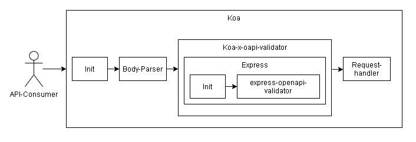

Koa port of the popular [express-openapi-validator](https://www.npmjs.com/package/express-openapi-validator) library.
See [Intention](#intention)

<div align="center">
    
</div>

# Intention

I was looking for a OpenAPI validation middleware solution for Koa. However, I was unable to find anything that (a) had the required functionality and (b) was actively maintained.
Therefore, I wrote this library as a port to the popular [express-openapi-validator](https://www.npmjs.com/package/express-openapi-validator) which satisfies the requirements and with which I have worked before.

This does come with some drawbacks as the solution used in express-openapi-validator has been tailored for express and thus is not useable as [koa-openapi-validator](https://www.npmjs.com/package/koa-openapi-validator) shows.

If there is any solution for Koa that is sufficient, I would recommend using this instead of this.

# Usage

This library should be integrated as a normal Koa middleware.
Error-Handling and everything else should be done the normal "Koa way".

1. Install the library

```bash
npm i koa-x-oapi-validator
```

2. Initialize the middleware

```ts
const validator = new KoaOpenAPIValidator({
  apiSpec: OPENAPI_SPEC,
  validateRequests: true,
  validateResponses: true,
});
const validatorMw = validator.use();
```

3. Use the middleware

```ts
router.post('/hello', validatorMw, async (ctx: Koa.Context) => {
  ctx.status = 200;
  ctx.body = {
    message: 'Hello World!',
  };
});
```

# Debugging

To enable debug logging set the environment variable `DEBUG=validator.*` (see [debug](https://www.npmjs.com/package/debug)).
